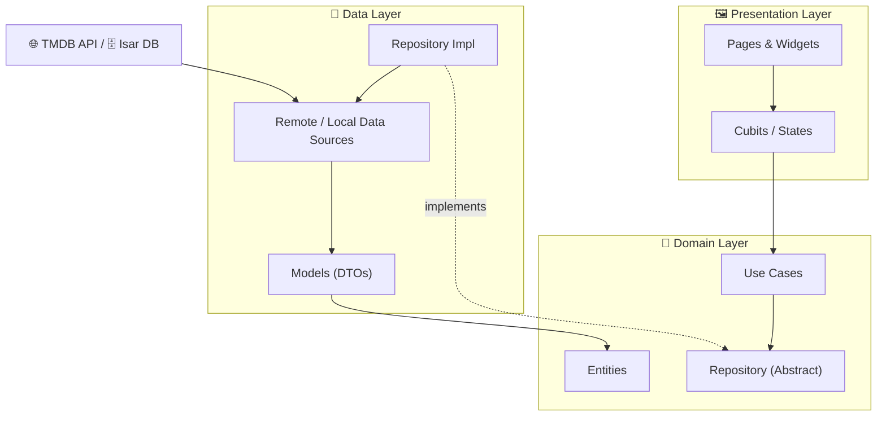
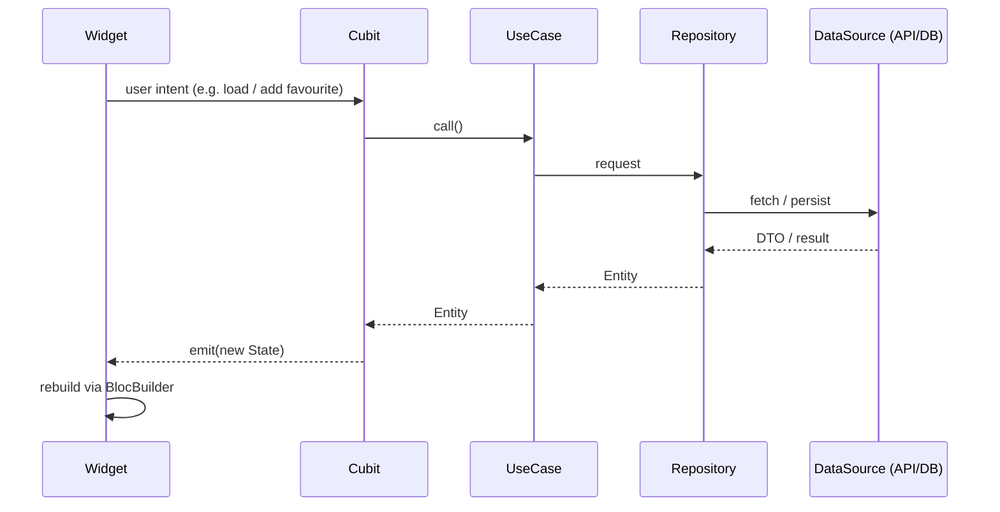

<div align="center">

# 🎬 MovieApp

### A modern, cross-platform movie discovery app built with Flutter & The Movie Database (TMDB) API

_Browse what's now playing, explore top-rated films and live TV series, watch trailers, and curate your own offline favourites — all wrapped in a polished, theme-aware UI._

<br />


</div>

---

## 📖 Table of Contents

- [Overview](#-overview)
- [Demo Video](#-demo-video)
- [Screenshots](#-screenshots)
- [Features](#-features)
- [Tech Stack](#-tech-stack)
- [Clean Architecture](#-clean-architecture)
- [Folder Structure](#-folder-structure)
- [State Management](#-state-management)
- [API Configuration](#-api-configuration)
- [Installation](#-installation)
- [Build Instructions](#-build-instructions)
- [Roadmap](#-roadmap)
- [Contributing](#-contributing)
- [License](#-license)
- [Author](#-author)

---

## 🌟 Overview

**MovieApp** is a feature-rich Flutter client for [The Movie Database (TMDB)](https://www.themoviedb.org/). It lets users discover movies and TV series through a rich, sectioned home feed, search the full TMDB catalogue, dive into detailed movie pages with cast and trailers, and save titles to a fully offline favourites collection.

The project is intentionally built as a **reference implementation of Clean Architecture** in Flutter — every feature is split into `data`, `domain`, and `presentation` layers, wired together through explicit composition roots and driven by the **Cubit / Bloc** state-management pattern.

**Highlights**

- 🧭 Feature-first, layered Clean Architecture with clear boundaries.
- 🎨 System-aware theming (Light / Dark / System) with persistence.
- 💾 Offline-first favourites powered by the Isar database.
- ⚡ Skeleton loading states for a smooth perceived performance.
- ▶️ In-app YouTube trailer playback.

---

## 🎥 Demo Video

> A short walkthrough of the app in action.

<div align="center">

[](https://youtube.com/shorts/AR6ryBz34FI?feature=share)

</div>

---

## 📱 Screenshots

> Drop your captures into `assets/screenshots/` and update the paths below.

| Home | Search | Details |
| :--: | :----: | :-----: |
|  |  |  |

| Favourites | Profile | Dark Mode |
| :--------: | :-----: | :-------: |
|  |  |  |

---

## ✨ Features

### 🏠 Home
- **Hero banner carousel** with animated page indicators for spotlight titles.
- **Now Playing** section powered by the TMDB `now_playing` endpoint.
- **Top Rated** movies slider.
- **Trending** movies feed.
- **Live TV Series** section (`on_the_air`).
- **Skeleton shimmer loading** while data is fetched.
- Quick **search shortcut** that jumps directly to the Search tab and focuses the field.

### 🔍 Search
- Full-text movie search against the TMDB catalogue (paginated).
- **Genre grid** for browsing by category with custom gradients and icons.
- **Recent searches** history and **trending searches** suggestions.
- Live search suggestions and dedicated loading / empty / error states.

### 🎬 Movie Details
- Rich detail page: poster, backdrop, rating, release info, genres and tagline.
- **Cast** list rendered from the TMDB credits endpoint.
- **Expandable overview** with "read more / read less" behaviour.
- **In-app YouTube trailer** playback.
- **Share** a title via the native share sheet.
- One-tap **add / remove from favourites**.

### ⭐ Favourites
- Fully **offline** collection persisted with the Isar database.
- Toggle between **grid** and **list** layouts.
- **Search and filter** within saved favourites.
- Confirmation dialog before removing an item.
- Reactive empty, no-matches, loading and error states.

### 👤 Profile
- **Theme switch** — Light, Dark, or follow System.
- Profile header, stats cards, "continue watching" and settings sections.

### 🎨 App-wide
- **Adaptive theming** with real-time OS brightness syncing and persistence.
- **Native splash screen** and custom launcher icons.
- Custom **bottom navigation** (Google Nav Bar) across Home · Favourites · Search · Profile.

---

## 🛠 Tech Stack

| Category | Packages / Tools |
| --- | --- |
| **Framework** | [Flutter](https://flutter.dev) (Dart SDK `^3.11.0`) |
| **State Management** | `bloc`, `flutter_bloc` (Cubit pattern) |
| **Networking** | `dio` with a custom `DioClient` & error interceptor |
| **Routing** | `go_router` |
| **Local Database** | `isar_community`, `isar_community_flutter_libs`, `path_provider` |
| **Preferences** | `shared_preferences` (theme persistence) |
| **Serialization** | `json_serializable`, `json_annotation`, `build_runner` |
| **Functional / Models** | `fpdart`, `equatable` |
| **Environment** | `flutter_dotenv` |
| **UI & UX** | `google_fonts`, `google_nav_bar`, `carousel_slider`, `smooth_page_indicator`, `cached_network_image`, `skeletonizer`, `readmore`, `animations` |
| **Media & Sharing** | `youtube_player_flutter`, `share_plus` |
| **Formatting** | `intl` |
| **Tooling** | `flutter_launcher_icons`, `flutter_native_splash`, `flutter_lints` |

---

## 🏛 Clean Architecture

The project follows a **feature-first Clean Architecture**. Each feature is a self-contained module split into three layers, with dependencies pointing **inward** — the presentation and data layers depend on the domain, never the reverse.



**Layer responsibilities**

| Layer | Responsibility | Examples in this repo |
| --- | --- | --- |
| **Domain** | Pure business rules — entities, abstract repository contracts, and use cases. Zero Flutter/IO dependencies. | `GetMovieDetailUseCase`, `AddFavourite`, `FavouritesRepository` |
| **Data** | Implements domain contracts; talks to TMDB via Dio and to Isar for local storage; maps DTOs ⇄ entities. | `MovieDataSource`, `FavouritesRepositoryImpl`, `FavouriteMapper` |
| **Presentation** | UI and state. Cubits consume use cases and emit immutable states the widgets react to. | `DetailsCubit`, `FavouritesCubit`, `home_page.dart` |

Dependencies are assembled in explicit **composition roots** (`core/di/injection.dart` and each feature's `*_injection.dart`) rather than a service locator, keeping wiring transparent and testable.

---

## 📂 Folder Structure

```text
lib/
├── main.dart                     # App entry point & bootstrap
├── core/                         # Cross-cutting concerns
│   ├── constants/                # Genre catalogue, static data
│   ├── di/                       # Composition root (Injection)
│   ├── error/                    # Failure types
│   ├── network/                  # DioClient + error interceptor
│   ├── router/                   # go_router configuration
│   ├── theme/                    # ThemeCubit, colors, app theme, persistence
│   └── utils/                    # Shared helpers
│
└── feature/
    ├── splash/                   # Native-backed splash screen
    ├── main/                     # Shell with bottom navigation (IndexedStack)
    │
    ├── home/                     # Discovery feed
    │   ├── data/                 # data_source, models, repository_impl
    │   ├── domain/               # entities & contracts
    │   └── presentation/         # cubits, page, widgets (hero, sections, items)
    │
    ├── search/                   # Search, genres, recent & trending
    │   ├── data/
    │   └── presentation/         # search_cubit, page, widgets
    │
    ├── details/                  # Movie details, cast, trailer, share
    │   ├── data/
    │   ├── domain/               # use cases, entities, repository
    │   └── presentation/         # cubit, pages, widgets
    │
    ├── favourite/                # Offline favourites (Isar)
    │   ├── data/                 # datasource, mapper, models, repository
    │   ├── domain/               # entities, usecases, repository
    │   ├── presentation/         # cubit, page, widgets
    │   └── favourite_injection.dart
    │
    └── profile/                  # Profile, stats & theme switch
```

---

## 🔄 State Management

MovieApp uses the **Cubit** flavour of the [Bloc](https://bloclibrary.dev/) library — a lightweight, boilerplate-free way to manage state with immutable state objects.



**Key patterns used**

- **One Cubit per concern** — `MovieCubit`, `NowPlayingCubit`, `TopRatedCubit`, `TvSeriesCubit`, `SearchCubit`, `DetailsCubit`, `FavouritesCubit`, `ThemeCubit`.
- **Immutable states** with explicit status enums (`loading / loaded / error`), often backed by `Equatable`.
- **Shared singleton** for `FavouritesCubit`, so the Details screen (writer) and the Favourites screen (reader) observe a single source of truth.
- **Reactive theming** — `ThemeCubit` persists the selected mode and keeps `ThemeMode.system` in sync with live OS brightness changes.

---

## 🔑 API Configuration

MovieApp is powered by the **TMDB REST API** (`https://api.themoviedb.org`) using **v4 bearer-token** authentication.

### 1. Get a TMDB API token

1. Create a free account at [themoviedb.org](https://www.themoviedb.org/signup).
2. Go to **Settings → API** and request an API key.
3. Copy your **API Read Access Token** (v4 bearer token).

### 2. Create a `.env` file

At the project root, create a file named `.env`:

```env
TMDB_TOKEN=your_tmdb_read_access_token_here
```

> ℹ️ The token is loaded at startup via `flutter_dotenv` and injected into the `Authorization: Bearer …` header by `DioClient`. `.env` is git-ignored — **never commit your token**.

### Endpoints used

| Feature | Endpoint |
| --- | --- |
| Now Playing | `GET /3/movie/now_playing` |
| Top Rated | `GET /3/movie/top_rated` |
| Live TV Series | `GET /3/tv/on_the_air` |
| Search | `GET /3/search/movie?query={q}&page={n}` |
| Movie Details | `GET /3/movie/{id}` |
| Cast & Trailers | `GET /3/movie/{id}/credits`, `/videos` |

---

## 🚀 Installation

### Prerequisites

- [Flutter SDK](https://docs.flutter.dev/get-started/install) with Dart `^3.11.0`
- Android Studio / Xcode (for device or emulator)
- A TMDB API token (see [API Configuration](#-api-configuration))

### Steps

```bash
# 1. Clone the repository
git clone https://github.com/<your-username>/movieapp.git
cd movieapp

# 2. Install dependencies
flutter pub get

# 3. Add your TMDB token
echo "TMDB_TOKEN=your_token_here" > .env

# 4. Generate serialization & database code
dart run build_runner build --delete-conflicting-outputs

# 5. Run the app
flutter run
```

---

## 🏗 Build Instructions

Generate launcher icons and the native splash (first-time setup):

```bash
dart run flutter_launcher_icons
dart run flutter_native_splash:create
```

Build release artifacts:

```bash
# Android APK
flutter build apk --release

# Android App Bundle (Play Store)
flutter build appbundle --release

# iOS (macOS + Xcode required)
flutter build ios --release
```

Run quality checks:

```bash
flutter analyze
flutter test
```

---

## 🗺 Roadmap

- [ ] TV series detail pages (parity with movie details)
- [ ] User authentication & TMDB account sync
- [ ] Pagination / infinite scroll on the home feed
- [ ] Pull-to-refresh across sections
- [ ] Watchlist separate from favourites
- [ ] Localization (i18n) beyond the current strings
- [ ] Unit, cubit and widget test coverage
- [ ] Web & desktop targets

---

## 🤝 Contributing

Contributions are welcome and appreciated! To contribute:

1. **Fork** the repository.
2. Create a feature branch: `git checkout -b feature/amazing-feature`.
3. Commit your changes: `git commit -m 'feat: add amazing feature'`.
4. Run `flutter analyze` and ensure the app builds.
5. Push the branch and open a **Pull Request**.

Please follow the existing Clean Architecture conventions and keep features layered into `data` / `domain` / `presentation`.

---

## 📄 License

This project is released under the **MIT License**. See the [`LICENSE`](LICENSE) file for details.

> Movie data and imagery are provided by [The Movie Database (TMDB)](https://www.themoviedb.org/). This product uses the TMDB API but is not endorsed or certified by TMDB.

---

## 👤 Author

**Ubaydullayev Jasurbek**

- 📧 [ubaydullayevjasurbek777@gmail.com](mailto:ubaydullayevjasurbek777@gmail.com)

<div align="center">

If you find this project helpful, please consider giving it a ⭐️!

_Built with ❤️ and Flutter._

</div>
